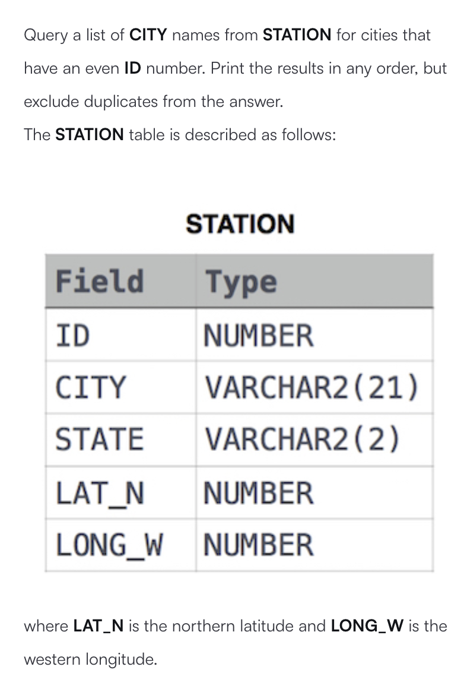
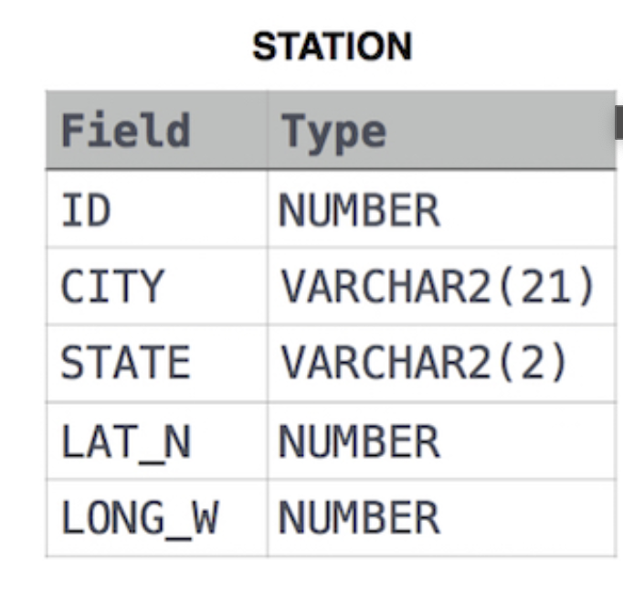

## Problems

#### Q1: Write the sql syntax ? 



**Answer**:

```sql
select distinct city from station where mod(id,2)=0;
```

Q2:Find the difference between the total number of city entries in the table and the number of distinct city entries in the table .The station table is described as follows :



where LAT_N is the northern latitude and LONG_W is the western longitude. For example if there are three records in the table with CITY values 'New York','New York' , 'Bengaluru' , there are 2 different city names 'New York' and 'Bengaluru'. The query returns 1 , because *total number of records-number of unique city names*

**Answer**:

```sql
SELECT (SELECT COUNT(city) from STATION)-(SELECT  COUNT(DISTINCT city) FROM STATION) as Difference ;
```

#### Q3: [Weather Observation Station 5](https://www.hackerrank.com/challenges/weather-observation-station-5/problem?isFullScreen=true)

**Solution**:

The sql query is given below : 

```sql
select city,length(city) as length from station order by length asc , city asc limit 1;
select city , length(city) as length from station order by length desc , city asc limit 1;
```

#### Q4:[Weather Observation Station 5](https://www.hackerrank.com/challenges/weather-observation-station-6/problem?isFullScreen=true)

**Solution**:

The sql query is given below:

```sql
select distinct city from station where city like "a%" or city like "e%" or city like "i%" or city like "o%" or city like "u%";
```

